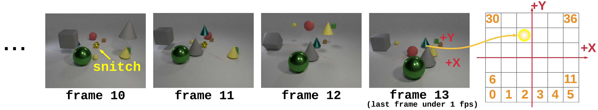
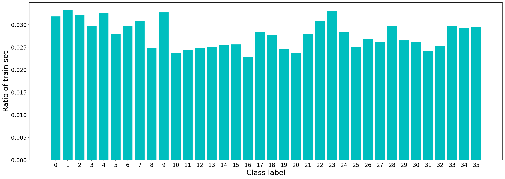
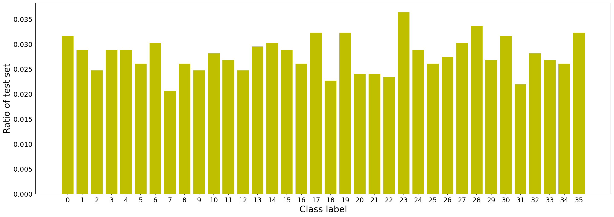

CATER-h 
==================================================
**Honglu Zhou<sup>*</sup>, Asim Kadav, Farley Lai, Alexandru Niculescu-Mizil, Martin Renqiang Min, Mubbasir Kapadia, Hans Peter Graf**

(<sup>*</sup>Contact: honglu.zhou@rutgers.edu)


**CATER-h** is the dataset proposed for the **Video Reasoning** task, specifically, the problem of **Object Permanence**, investigated in [Hopper: Multi-hop Transformer for Spatiotemporal Reasoning](https://openreview.net/pdf?id=MaZFq7bJif7) accepted to ICLR 2021. 
Please refer to our [full paper](https://arxiv.org/abs/2103.10574) for detailed analysis and evaluations.




## 1. Overview

This repository provides the CATER-h dataset used in the paper "**Hopper: Multi-hop Transformer for Spatiotemporal Reasoning**", as well as instructions/code to create the CATER-h dataset.

If you find the dataset or the code helpful, please cite:

Honglu Zhou, Asim Kadav, Farley Lai, Alexandru Niculescu-Mizil, Martin Renqiang Min, Mubbasir Kapadia, Hans Peter Graf. Hopper: Multi-hop Transformer for Spatiotemporal Reasoning. In International Conference on Learning Representations (ICLR), 2021.

```bibtex
@inproceedings{zhou2021caterh,
    title = {{Hopper: Multi-hop Transformer for Spatiotemporal Reasoning}},
    author = {Zhou, Honglu and Kadav, Asim and Lai, Farley and Niculescu-Mizil, Alexandru and Min, Martin Renqiang and Kapadia, Mubbasir and Graf, Hans Peter},
    booktitle = {ICLR},
    year = 2021
}  
```

## 2. Dataset

A pre-generated sample of the dataset used in the paper is provided [here](https://drive.google.com/drive/folders/1cEPXQ6VYnMSqA5BuQsC43QhjWP2KQw_I?usp=sharing).
If you'd like to generate a version of the dataset, please follow instructions in the following.

## 3. Requirements
1. All CLEVR requirements (eg, Blender: the code was used with v2.79b).
2. This code was used on Linux machines.
3. GPU: This code was tested with multiple types of GPUs and should be compatible with most GPUs. By default it will use all the GPUs on the machine.
4. All [DETR](https://github.com/facebookresearch/detr) requirements.
You can check the [site-packages](https://drive.google.com/file/d/1sv9Fq6Id6gn9Olg4FIsTTSF0HcsUSrwc/view?usp=sharing) of our conda environment (Python3.7.6) used.

## 4. Generating CATER-h

### 4.1  ```Generating videos and labels```
(We modify code provided by [CATER](https://github.com/rohitgirdhar/CATER).)

1. ```cd generate/```

2. ```echo $PWD >> blender-2.79b-linux-glibc219-x86_64/2.79/python/lib/python3.5/site-packages/clevr.pth```
(You can download our [blender-2.79b-linux-glibc219-x86_64](https://drive.google.com/file/d/1GyoBnXBGbXn_sl37_eHR41gxPq5quLGX/view?usp=sharing).)

3. Run ```time python launch.py``` to start generating. Please read through the script to change any settings, paths etc. The command line options should also be easy to follow from the script (e.g., ```--num_images``` specifies the number of videos to generate).

4. ```time python gen_train_test.py``` to generate labels for the dataset for each of the tasks. Change the parameters on the top of the file, and run it.
  
### 4.2  ```Obtaining frame and object features```
You can find our extracted frame and object features [here](https://drive.google.com/file/d/1591853VR4W3f8cLGSfeCMzc1ZbL04nvL/view?usp=sharing). The CNN backbone we utilized to obtain the frame features is a pre-trained ResNeXt-101 model. We use [DETR](https://github.com/facebookresearch/detr) trained on the [LA-CATER](https://chechiklab.biu.ac.il/~avivshamsian/OP/OP_HTML.html) dataset to obtain object features. 

### 4.3 ```Filtering data by the frame index of the last visible snitch```
1. ```cd extract/```

2. Download our pretrained object detector from [here](https://drive.google.com/file/d/1Tqq5PuX6rNtX70DKpUd3xfexZ-3Aij_9/view?usp=sharing). Create a folder ```checkpoints```. Put the pretrained object detector into the folder ```checkpoints```.

3. Change paths etc in ```extract/configs/CATER-h.yml```

4. ```time ./run.sh```

This will generate an ```output``` folder with pickle files that save the frame index of the last visible snitch and the detector's confidence.

5. Run ```resample.ipynb``` which will resample the data to have balanced train/val set in terms of the class label and the frame index of the last visible snitch.






  
## Acknowledgments
The code in this repository is heavily based on the following publically available implementations:
- https://github.com/rohitgirdhar/CATER
